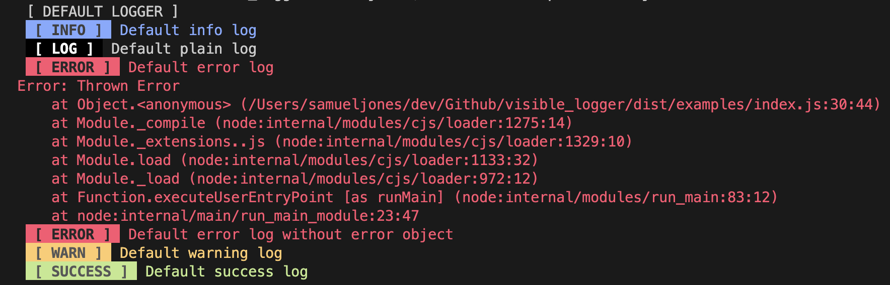
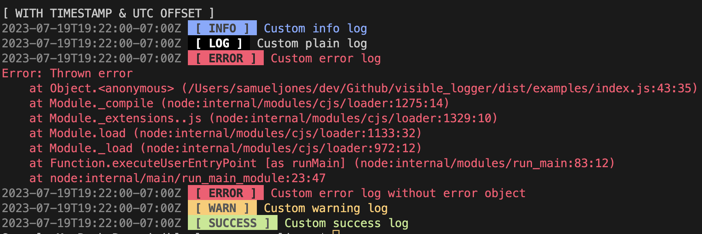

# Visible Logger



Visble logger provides a simple way to create easily identifiable log statements using the console formatting capabilities of [Chalk](https://www.npmjs.com/package/chalk). There are preset log styles for info, warning, error, success, and regular log statements. 
## Installation

Visble Logger can be installed using `npm install visible_logger` or `yarn add visible_logger`.

## Importing into Project

To use the logger with default options use  
`import logger from 'visible_logger'`  

To use the logger with default options use  
`import 'logger' from 'visible_logger'`  

If you would like to pass custom options to Visible Logger, use  
`import { loggerFactory } from 'visible_logger`.

## Customizing

After importing `loggerFactory`, create the logger with options as follows. By default the logger will not print timestamps, but will include a default or custom category for each log. If timestamps are desired, they can be printed with or without the UTC offset. If includeCategory is set to false, the log statements will print with the given text only.
```
const logger = loggerFactory({
    includeTimestamps: false,
    includeUtcOffset: false,
    includeCategory: true,
})
```

## Usage

Simply call the logging methods on the logger object to write to the console:
```
logger.info('Informational log');
```
This will print a blue informational log with the default category name of INFO. You can customize the category name for all log types except error logs:
```
logger.success('Successfully wrote record', 'Database');
```
Error logs can be written with or without an error object. If an error object is included, the stack trace will also print:
```
logger.error('An error occured', errorObject);
```

## Related

- [chalk](http://github.com/chalk/chalk) - Supports writing colored strings to supported consoles
- [dayjs](https://github.com/iamkun/dayjs) - This package uses dayjs as a lightweight method to format date strings for timestamps